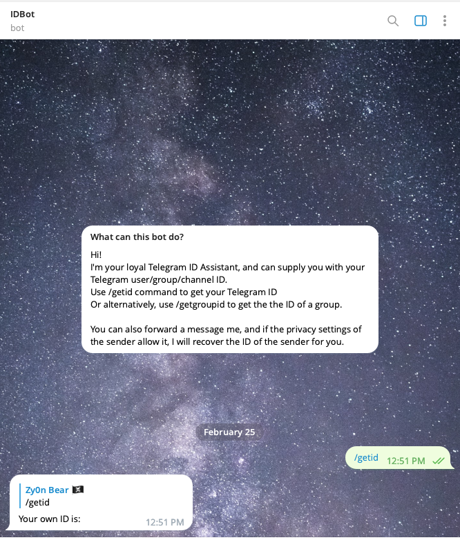

# zyb0t-launcher

## Table of Contents

- [Usage](#usage)


### Prerequisites


```
Docker
and/or
Yarn/NodeJS
```

### Installing

Clone the repository locally, enter its directory.

Gunbot will launch and be visible at port 3001 on your local machine. To alter this, inside docker-compose.yml change the ports. 
```yml
    ports: 
      - 3001:5000
```
```sh
# Shared volume
/data/gunthy_linux 
```
## Usage <a name = "usage"></a>
Launching the bundle.
This will generate a container, inside it, will be a gunbot container and zyb0t container. 
They share :

``` docker compose -f 'docker-compose.yml' up -d --build ```
> This is what you should see in docker desktop, ie: the 'combined' output from both containers


> Access the zyb0t container terminal
  
  
  
## Commands to input:
  ```sh
  cd gunthy_linux/zybot
  ./zyb0t-linux
  ```
> How to get telegram_chatId
> Contact @myidbot https://t.me/myidbot on telegram


> How to get telegram_token
> Contact @BotFather https://t.me/BotFather on telegram


> What you would see if you ran zybot without setting up gunbot first.


> What you would see if you run gunbot, complete setup & add exchanges etc...
> And if you had a valid zyb0t license.

